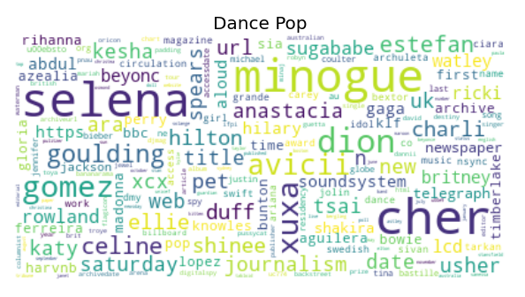
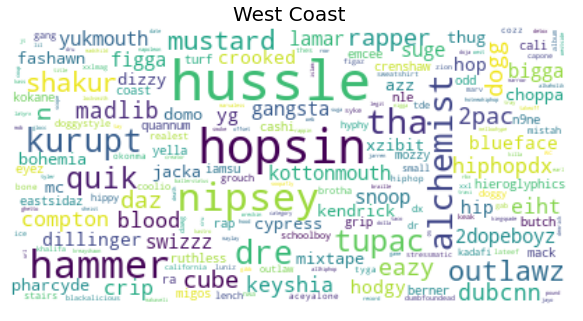
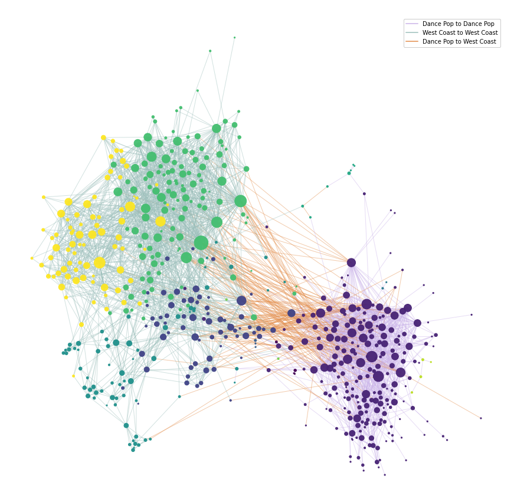

# Data science and music?
Have you ever wondered how the artists of two different music genres might be connected? If so, you've come to the right place. This webpage provides an exploration of the Wikipedia pages of artists from the two genres "West Coast Hip Hop" and "Dance Pop", using links between the pages to create a network connecting all artists. This network contains several communities, which are further explored. The Wikipedia pages provide a large amount of text, allowing for text and sentiment analysis of artists as well as communites. By including lyrics from some of the songs associated with the artists, it is also possible to explore sentiments of lyrics and investigate how these sentiments change over time.

# Selecting genres and retrieving data
- network overview?

# Delving into the network and calculating some basic statistics

- Insert degree distributions

- Insert network plot



# Defining genres with words

- Insert wordclouds for the two genres.

# Finding communities within network

- Show the network, colored by communities.

- List the artists in the communities

| Community 1  | Community 2 | Community 3 | Community 4 | Community 5 | Community 6 |
| ------------- | ------------- | ------------- | ------------- | ------------- | ------------- | 
| Madonna \n (Dance Pop)  | Kendrick Lamar (West Coast) | Paris (West Coast) | Planet Asia (West Coast) | Exposé (Dance Pop) | Snoop Dogg (West Coast) |
| Britney Spears (Dance Pop)  | Chris Brown (Dance Pop) | Subnoize Souljaz (West Coast) | Dilated Peoples (West Coast) | Xuxa (Dance Pop) | Dr. Dre (West Coast) |
| Rihanna (Dance Pop) | Wiz Khalifa (West Coast) | Kottonmouth Kings (West Coast) | Murs (West Coast) | Company B (Dance Pop) | Ice Cube (West Coast) |
| Michael Jackson (Dance Pop) | Dom Kennedy (West Coast) | Havoc (West Coast) | Gorillaz (Dance Pop) | Will to Power (Dance Pop) | The Game (West Coast) |
| Janet Jackson (Dance Pop) | Tyga (West Coast) | Young Murder Squad (West Coast) | Evidence (West Coast) | Mars (West Coast) | Tha Dogg Pound (West Coast) |
| Lady Gaga (Dance Pop) | Problem (West Coast) | Kingspade (West Coast) | Del the Funky Homosapien (West Coast) | The Cover Girls (Dance Pop) | Kurupt (West Coast) |
| Nicki Minaj (Dance Pop) | Alchemist (West Coast) | Potluck (West Coast) | People Under The Stairs (West Coast) | t.A.T.u. (Dance Pop) | Eazy-E (West Coast) |
| Mariah Carey (Dance Pop) | Ty Dolla $ign (West Coast) | Delinquent Habits (West Coast) | Pigeon John (West Coast) | Lisa Lisa and Cult Jam (Dance Pop) | N.W.A (West Coast) |
| Katy Perry (Dance Pop) | YG (West Coast) | Hed PE (West Coast) |  Domino (West Coast) | ? | DJ Quik (West Coast) |
| Justin Timberlake (Dance Pop) | Schoolboy Q (West Coast) | Sen Dog (West Coast) | The Grouch (West Coast) | ? | Kam (West Coast) |

- Show a distribution plot of the number of nodes in each community

- Wordcloud + sentiment analysis

# Songs and sentiment over time

- Sentimentanalysis over time

- Wordclouds based on songs for some the five biggest nodes in the artist network

